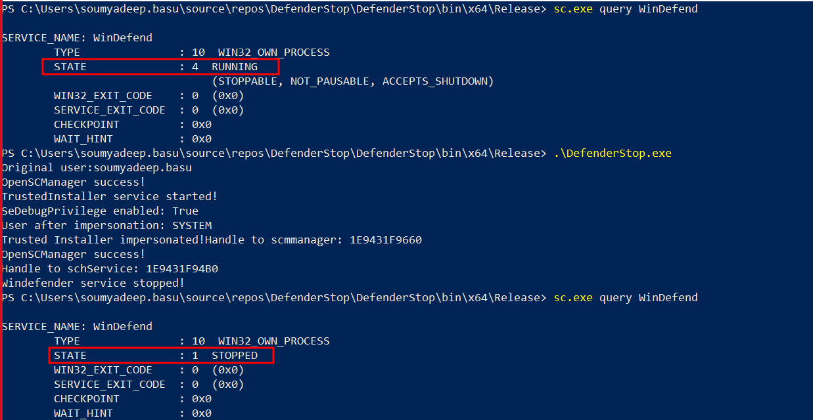

## StopDefenderService

This is a C# project to stop the defender service using via token impersonation

### Methodology

The WinDefend process can neither be stopped an admin with high privileges nor as the SYSTEM. But it can only be stopped with the privileges of the TrustedInstaller group.

In this technique, we first steal the token from the WinLogon service, and escalate to SYSTEM integrity. Then we steal the token from the TrustedInstaller service and impersonate it. This will finally allow us to stop the WinDefend service.

### Attack Flow

The following is the diagram of the attack flow. (Source: [Original Blogpost](https://www.securityartwork.es/2021/09/27/trustedinstaller-parando-windows-defender/)).

Apart from the original functionality, we have also added the Enable Debug Privilege feature, which sets the debug privilege too.

### References

- https://www.securityartwork.es/2021/09/27/trustedinstaller-parando-windows-defender/
- https://github.com/last-byte/DefenderSwitch
- https://github.com/APTortellini/DefenderSwitch
- https://guidedhacking.com/threads/c-sedebugprivilege-adjusttokenprivileges.14926/
